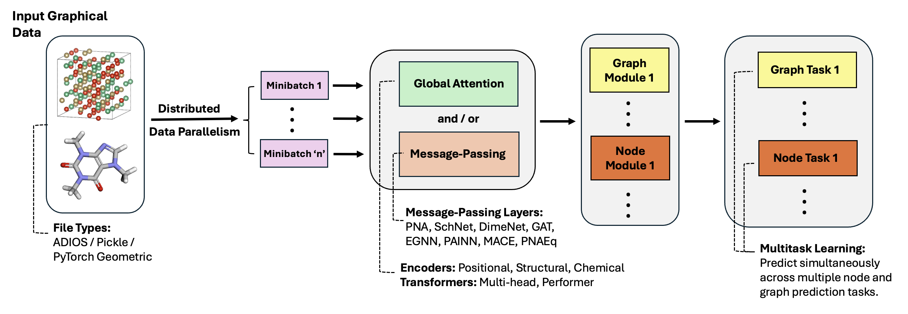

# HydraGNN

Distributed PyTorch implementation of multi-headed graph convolutional neural networks


## Capabilities



- **Multi-headed Prediction** for graph and node-level properties  
- **Distributed Data Parallelism** at supercomputing level
- **Convolutional Layers** as a hyperparameter  
- **Geometric Equivariance** in convolution and prediction  
- **Global Attention**


## Dependencies

To install required packages with only basic capability (`torch`,
`torch_geometric`, and related packages)
and to serialize+store the processed data for later sessions (`pickle5`):

**Recommended approach - standard installation:**
```bash
# Install all core dependencies (base + PyTorch + PyTorch Geometric)
pip install -r requirements.txt

# Or use the installation script
./install_dependencies.sh all
```

**Alternative approach for reproducible installation:**
```bash
# Use the provided installation script
./install_dependencies.sh

# Or install manually with consistent settings:
pip install --no-build-isolation -v -r requirements.txt
```

**Modular installation (choose what you need):**
```bash
# Base only (scientific computing, materials science, visualization)
pip install -r requirements-base.txt

# Add PyTorch
pip install -r requirements-torch.txt

# Add PyTorch Geometric  
pip install -r requirements-pyg.txt

# Add optional features (HPO, FAIRChem, etc.)
pip install -r requirements-optional.txt
```

If you plan to modify the code, include packages for formatting (`black`) and
testing (`pytest`) the code:
```bash
pip install -r requirements-dev.txt
# Or with the script:
./install_dependencies.sh all dev
```

Detailed dependency installation instructions are available on the
[Wiki](https://github.com/ORNL/HydraGNN/wiki/Install)


## Installation

After checking out HydgraGNN, we recommend to install HydraGNN in a
developer mode so that you can use the files in your current location
and update them if needed:
```bash
python -m pip install -e .
```

Or, simply type the following in the HydraGNN directory:
```bash
export PYTHONPATH=$PWD:$PYTHONPATH
```

Alternatively, if you have no plane to update, you can install
HydraGNN in your python tree as a static package:
```bash
python setup.py install
```

## Quick Start

For detailed instructions, see the [**Comprehensive User Manual**](USER_MANUAL.md).

Below are the four main functionalities for running the code.
1. Training a model, including continuing from a previously trained model using configuration options:
```python
import hydragnn
hydragnn.run_training("examples/configuration.json")
```
2. Saving a model state:
```python
import hydragnn
model_name = model_checkpoint.pk
hydragnn.save_model(model, optimizer, model_name, path="./logs/")
```
3. Loading a model state:
```python
import hydragnn
model_name = model_checkpoint.pk
hydragnn.load_existing_model(model, model_name, path="./logs/")
```
4. Making predictions from a previously trained model:
```python
import hydragnn
hydragnn.run_prediction("examples/configuration.json", model)
```
The `run_training` and `run_predictions` functions are convenient routines that encapsulate all the steps of the training process (data generation, data pre-processing, training of HydraGNN models, and use of trained HydraGNN models for inference) on toy problems, which are included in the CI test workflows. Both `run_training` and `run_predictions` require a JSON input file for configurable options. The `save_model` and `load_model` functions store and retrieve model checkpoints for continued training and subsequent inference. Ad-hoc example scripts where data pre-processing, training, and inference are done for specific datasets are provided in the `examples` folder.

### Datasets

Built in examples are provided for testing purposes only. One source of data to
create HydraGNN surrogate predictions is DFT output on the OLCF Constellation:
https://doi.ccs.ornl.gov/

Detailed instructions are available on the
[Wiki](https://github.com/ORNL/HydraGNN/wiki/Datasets)

### Configurable settings

HydraGNN uses a JSON configuration file (examples in `examples/`):

There are many options for HydraGNN; the dataset and model type are particularly
important:
 - `["Verbosity"]["level"]`: `0`, `1`, `2`, `3`, `4` (int)
 - `["Dataset"]["name"]`: `CuAu_32atoms`, `FePt_32atoms`, `FeSi_1024atoms` (str)

Additionally, many important arguments fall within the `["NeuralNetwork"]` section:

- `["NeuralNetwork"]`
  - `["Architecture"]`
    - `["mpnn_type"]`  
      Accepted types: `CGCNN`, `DimeNet`, `EGNN`, `GAT`, `GIN`, `MACE`, `MFC`, `PAINN`, `PNAEq`, `PNAPlus`, `PNA`, `SAGE`, `SchNet` (str)
    - `["num_conv_layers"]`  
      Examples: `1`, `2`, `3`, `4` ... (int)
    - `["output_heads"]`  
      Task types: `node`, `graph` (int)
    - `["global_attn_engine"]`
      Accepted types: `GPS`, `None`
    - `["global_attn_type"]`
      Accepted types: `multihead`
    - `["pe_dim"]`
      Dimension of positional encodings (int)
    - `["global_attn_heads"]`
      Examples: `1`, `2`, `3`, `4` ... (int)
    - `["hidden_dim"]`  
      Dimension of node embeddings during convolution (int) - must be a multiple of "global_attn_heads" if "global_attn_engine" is not "None" 
            

  - `["Variables of Interest"]`
    - `["input_node_features"]`  
      Indices from nodal data used as inputs (int)
    - `["output_index"]`  
      Indices from data used as targets (int)
    - `["type"]`  
      Either `node` or `graph` (string)
    - `["output_dim"]`  
      Dimensions of prediction tasks (list)

  - `["Training"]`
    - `["num_epoch"]`  
      Examples: `75`, `100`, `250` (int)
    - `["batch_size"]`  
      Examples: `16`, `32`, `64` (int)
    - `["Optimizer"]["learning_rate"]`  
      Examples: `2e-3`, `0.005` (float)
    - `["compute_grad_energy"]`  
      Use the gradient of energy to predict forces (bool)


### Citations
"HydraGNN: Distributed PyTorch implementation of multi-headed graph convolutional neural networks", Copyright ID#: 81929619
https://doi.org/10.11578/dc.20211019.2

## Contributing

We encourage you to contribute to HydraGNN! Please check the
[guidelines](CONTRIBUTING.md) on how to do so.

## Documentation

- **Quick Start**: This README provides basic usage examples
- **[Comprehensive User Manual](USER_MANUAL.md)**: Detailed guide covering data pre-processing, model construction, scalable data management, and training
- **[Wiki](https://github.com/ORNL/HydraGNN/wiki)**: Additional technical documentation and datasets
