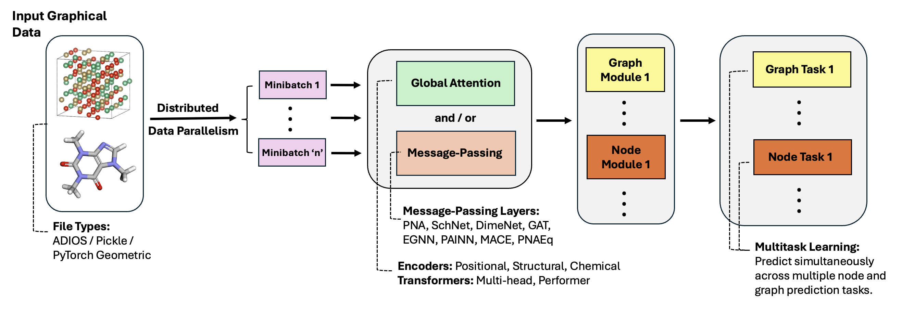

# HydraGNN

Scalable PyTorch Implementation of Multi-Headed Graph Neural Networks


## Capabilities



- **Multi-headed Prediction** for graph and node-level properties  
- **Distributed Training** via DDP, FSDP (v1/v2), and DeepSpeed at supercomputing scale
- **Convolutional Layers** as a hyperparameter  
- **Geometric Equivariance** in convolution and prediction (EGNN, PaiNN, PNAEq, MACE, DimeNet)
- **Global Attention** (GPS)
- **Multiple Precision Training** (FP32, BF16, FP64)
- **Machine-Learned Interatomic Potentials** with energy-conserving force prediction
- **Gradient Checkpointing** for memory-efficient training

### Optional graph-level conditioning
- Enable with `NeuralNetwork.Architecture.use_graph_attr_conditioning` (off by default) and choose mode via `graph_attr_conditioning_mode` (`"concat_node"` default, `"film"`, or `"fuse_pool"`).
- `concat_node` (default) appends `graph_attr` to node embeddings and projects back to hidden dimension; FiLM scales/shifts invariant channels per graph; `fuse_pool` fuses `graph_attr` with the pooled graph embedding before the heads.
- Conditioning consumes `data.graph_attr` and requires those global attributes to be rotation/translation invariant; providing orientation-dependent values will break equivariance by design.


## Dependencies

To install required packages with only basic capability (`torch`,
`torch_geometric`, and related packages)
and to serialize+store the processed data for later sessions (`pickle5`):

> **Python versions:** HydraGNN is tested and supported on **Python 3.11
> through 3.14**. Facility installation scripts default to Python 3.11 unless
> documented otherwise for that system.

**Recommended approach - standard installation:**
```bash
# Install all core dependencies (base + PyTorch + PyTorch Geometric)
pip install -r requirements.txt

# Or use the installation script
./install_dependencies.sh all
```

**Alternative approach for reproducible installation:**
```bash
# Use the provided installation script
./install_dependencies.sh

# Or install manually with consistent settings:
pip install --no-build-isolation -v -r requirements.txt
```

**Modular installation (choose what you need):**
```bash
# Base only (scientific computing, materials science, visualization)
pip install -r requirements-base.txt

# Add PyTorch
pip install -r requirements-torch.txt

# Add PyTorch Geometric  
pip install -r requirements-pyg.txt

# Add optional features (HPO, FAIRChem, etc.)
pip install -r requirements-optional.txt
```

`pyg-lib` is built from source in CI because its binary wheels are hosted
separately from PyPI. The official
[`pyg-lib` installation documentation](https://github.com/pyg-team/pyg-lib#installation)
explicitly supports this method. Install PyTorch first, then run:

```bash
pip install ninja wheel
pip install --no-build-isolation \
  "pyg_lib @ git+https://github.com/pyg-team/pyg-lib.git@26a2d1a06a4714da9bb804c19049afb4796971d7"
```

HydraGNN pins the source revision corresponding to `pyg-lib` 0.8.0 for
reproducibility. The build requires a working C++ compiler.

If you plan to modify the code, include packages for formatting (`black`) and
testing (`pytest`) the code:
```bash
pip install -r requirements-dev.txt
# Or with the script:
./install_dependencies.sh all dev
```

Detailed dependency installation instructions are available on the
[Wiki](https://github.com/ORNL/HydraGNN/wiki/Install)

The synthetic datasets used by model-quality CI tests have an explicit,
versioned generation and normalization contract. Contributors changing test
data or numerical quality thresholds should first read
[Unit-test data fixtures](docs/unit_test_data.md).


## Installation

After checking out HydgraGNN, we recommend to install HydraGNN in a
developer mode so that you can use the files in your current location
and update them if needed:
```bash
python -m pip install -e .
```

Or, simply type the following in the HydraGNN directory:
```bash
export PYTHONPATH=$PWD:$PYTHONPATH
```

Alternatively, if you have no plan to update, you can install
HydraGNN in your python tree as a static package:
```bash
python -m pip install .
```

## Quick Start

For detailed instructions, see the [**Comprehensive User Manual**](USER_MANUAL.md).

Below are the four main functionalities for running the code.
1. Training a model, including continuing from a previously trained model using configuration options:
```python
import hydragnn
from hydragnn.train import train_validate_test
from hydragnn.utils.model import load_existing_model, save_model

train_loader, val_loader, test_loader = hydragnn.preprocess.create_dataloaders(
    trainset, valset, testset, batch_size=32
)
train_validate_test(
    model, optimizer, train_loader, val_loader, test_loader,
    writer, scheduler, config["NeuralNetwork"], log_name, verbosity
)
```
2. Saving a model state:
```python
model_name = "model_checkpoint"
save_model(model, optimizer, model_name, path="./logs/")
```
3. Loading a model state:
```python
model_name = "model_checkpoint"
load_existing_model(model, model_name, path="./logs/")
```
4. Making predictions from a previously trained model:
```python
import hydragnn
errors, task_errors, targets, predictions = hydragnn.train.test(
    test_loader, model, verbosity
)
```
Dataset creation and preprocessing are explicit caller responsibilities. Pass prepared
datasets to `create_dataloaders`, construct the model and optimizer explicitly, and
call `train_validate_test` or `test`. This keeps application-specific data handling
and orchestration visible to the caller. The `save_model` and `load_model` functions
store and retrieve model checkpoints for continued training and inference.

The former `run_training` and `run_prediction` convenience functions have been
removed. Applications must now make dataset preparation, model construction, and
training or inference orchestration explicit, as demonstrated by the scripts under
`examples/`.

### Datasets

Built in examples are provided for testing purposes only. One source of data to
create HydraGNN surrogate predictions is DFT output on the OLCF Constellation:
https://doi.ccs.ornl.gov/

Detailed instructions are available on the
[Wiki](https://github.com/ORNL/HydraGNN/wiki/Datasets)

### Configurable settings

HydraGNN uses a JSON configuration file (examples in `examples/`):

There are many options for HydraGNN; the dataset and model type are particularly
important:
 - `["Verbosity"]["level"]`: `0`, `1`, `2`, `3`, `4` (int)
 - `["Dataset"]["name"]`: `CuAu_32atoms`, `FePt_32atoms`, `FeSi_1024atoms` (str)

Additionally, many important arguments fall within the `["NeuralNetwork"]` section:

- `["NeuralNetwork"]`
  - `["Architecture"]`
    - `["mpnn_type"]`  
      Accepted types: `AllScAIP`, `CGCNN`, `DimeNet`, `EGNN`, `GAT`, `GIN`, `MACE`, `MFC`, `PAINN`, `PNAEq`, `PNAPlus`, `PNA`, `SAGE`, `SchNet`, `UMA` (str)
    - `["num_conv_layers"]`  
      Examples: `1`, `2`, `3`, `4` ... (int)
    - `["output_heads"]`  
      Task types: `node`, `graph` (int)
    - `["global_attn_engine"]`
      Accepted types: `EquivariantTransformer`, `GPS`, `None`
    - `["global_attn_type"]`
      Accepted types: `multihead`, `performer`
    - `["pe_dim"]`
      Dimension of positional encodings (int)
    - `["global_attn_heads"]`
      Examples: `1`, `2`, `3`, `4` ... (int)
    - `["hidden_dim"]`  
      Dimension of node embeddings during convolution (int) - must be a multiple of "global_attn_heads" if "global_attn_engine" is not "None"
    - `["enable_interatomic_potential"]`  
      Enable MLIP mode with dynamic graph construction and energy-conserving force prediction (bool, default `false`)

  - `["Training"]`
    - `["global_attn_redraw_interval"]`
      Number of training batches between Performer random-feature projection
      redraws (positive int, default `1000`); set to `null` to keep the initial
      projection fixed. This setting has no effect when `global_attn_type` is
      `multihead` or while the model is in evaluation mode.

Performer approximates softmax attention with features produced from a random
projection matrix. Periodically replacing that matrix during training prevents
the learned model from depending on a single random approximation. HydraGNN
counts training batches and redraws the projection immediately before the next
model forward when the configured interval is reached. Redraw bookkeeping is
kept outside `HydraGPSConv.forward` so that execution strategies that repeat a
forward pass, such as activation checkpointing, do not accidentally count one
training batch more than once. For example:

```json
{
  "NeuralNetwork": {
    "Architecture": {
      "global_attn_engine": "GPS",
      "global_attn_type": "performer"
    },
    "Training": {
      "global_attn_redraw_interval": 1000
    }
  }
}
```

When GPS wraps an equivariant HydraGNN model, global attention operates only
on invariant node channels. Equivariant channels are updated by the local MPNN
and propagated alongside the globally attended invariant representation.

### Feature guides

- [GraphGPS and Performer configuration](#configurable-settings)
- [Equivariant all-to-all graph Transformer](docs/equivariant_graph_transformer.md)
- [UMA and AllScAIP integration](docs/uma_allscaip.md)
- [Cost-aware graph batching](docs/cost_aware_batching.md)
- [Reusable dataset downloads](docs/dataset_downloads.md)
- [Materials preprocessing](docs/materials_preprocessing.md)
- [HPC facility assets](scripts/hpc/README.md)

  - top-level `["Variables"]`
    - `["inputs"]` and `["outputs"]` contain named tensor specifications.
      Every specification has an attribute `name`, a `level` (`node`, `edge`,
      or `graph`), and a positive feature dimension `dim`. Inputs may also
      declare a semantic `role`; ordinary inputs use the default `feature`
      role, while Cartesian coordinates use `position`.

```json
"Variables": {
  "inputs": [
    {"name": "atomic_numbers", "level": "node", "dim": 1},
    {"name": "pos", "level": "node", "dim": 3, "role": "position"},
    {"name": "bond_attributes", "level": "edge", "dim": 4},
    {"name": "charge_and_spin", "level": "graph", "dim": 2}
  ],
  "outputs": [
    {"name": "energy", "level": "graph", "dim": 1},
    {"name": "forces", "level": "node", "dim": 3}
  ]
}
```

Each PyG sample must expose tensors with exactly those names. Node variables
must have shape `(N, dim)`, edge variables `(E, dim)`, and graph variables
`(1, dim)`. PyG therefore batches graph variables into `(B, dim)` without any
special collation rule. When multiple attributes of the same level are listed,
HydraGNN concatenates them along tensor dimension 1 in their JSON order. Thus,
node attributes with dimensions 2 and 3 produce an `(N, 5)` tensor, while graph
 attributes with dimensions 1 and 4 produce a `(1, 5)` tensor per sample.

Attribute names are not aliases: the example uses PyG's conventional `pos`
attribute, so the corresponding sample must provide `data.pos`. A different
name is valid only when the JSON specification and PyG attribute match exactly.
The `position` role is restricted to `pos` with node level and dimension 3.
HydraGNN validates this geometric input but keeps it separate from `data.x`, so
Cartesian coordinates do not become invariant scalar feature channels.

#### Why positions are not concatenated into `data.x`

`pos` is an input to a geometry-aware model, but it is not an ordinary scalar
node feature. Translating a structure changes every Cartesian coordinate, and
rotating it mixes the three coordinate components. If the coordinates were
concatenated directly into `data.x`, an otherwise invariant or equivariant
architecture could treat those frame-dependent values as scalar channels and
lose its intended translation or rotation behavior.

Declare Cartesian coordinates explicitly as:

```json
{"name": "pos", "level": "node", "dim": 3, "role": "position"}
```

For every sample, the matching `data.pos` must be a tensor of shape `(N, 3)`.
HydraGNN validates it and leaves it in `data.pos`; geometry-aware local MPNNs,
equivariant transformers, neighbor construction, and force calculations can
then consume the coordinates through their dedicated geometric paths. The
coordinates are excluded from both the constructed `data.x` and
`Architecture.input_dim`. Autograd information on `data.pos` is preserved, so
energy-gradient force models can still differentiate with respect to positions.

For example, with `atomic_numbers` and `pos` declared above, preparation gives
the model the following logically separate inputs:

```text
data.atomic_numbers ──> data.x       # ordinary node-feature channels
data.pos            ──> data.pos     # geometric coordinates, unchanged
```

When several node inputs have the default `feature` role, only those inputs are
concatenated into `data.x`, in JSON order. Never manually append `data.pos` to
`data.x`. This rule applies to any geometry-aware application, not only machine
learning interatomic potentials.

The contract is deliberately strict: `role: "position"` is accepted only for
an input named `pos` with `level: "node"` and `dim: 3`; outputs cannot have this
role. Conversely, declaring `pos` without `role: "position"` is rejected. A
schema must still declare at least one ordinary node input from which HydraGNN
can construct `data.x`.

Users must not construct HydraGNN's internal `data.x`, `data.edge_attr`,
`data.graph_attr`, `data.y`, or `data.y_loc` tensors in dataset importers.
HydraGNN validates the named source attributes and builds those tensors when a
sample is prepared from the schema:

- node inputs with role `feature` become `data.x`;
- edge inputs become `data.edge_attr`;
- graph inputs become `data.graph_attr`;
- outputs become the level-specific `data.node_output`, `data.edge_output`, and
  `data.graph_output` tensors; and
- all outputs are flattened in JSON order into `data.y`. `data.y_loc` stores
  the boundaries needed to recover each configured output from `data.y`.

The named source attributes remain on the PyG object after preparation. See the
Variables section of the [Comprehensive User Manual](USER_MANUAL.md#variables)
for the complete construction rules and a worked example.

Schema preparation happens before a training-ready dataset is serialized. When
that prepared dataset is later loaded from a HydraGNN pickle container, an
ADIOS dataset, or a directory of PyG `.pt` samples, the stored graph is
authoritative: HydraGNN uses its existing `x`, `edge_index`, `edge_attr`,
`graph_attr`, `y`, `y_loc`, descriptors, and positional encodings without
modifying them. Loading does not rebuild neighborhoods, renormalize edge
lengths, rerun descriptor transforms, or compile named variables again. A
change to any preprocessing choice therefore requires creation of a new
prepared dataset.

Source-variable names must not collide with HydraGNN's derived tensors. Names
such as `x`, `edge_attr`, `graph_attr`, `y`, `y_loc`, `node_output`,
`edge_output`, and `graph_output` are therefore rejected in both `inputs` and
`outputs`. Use a semantic source name such as `node_features`, `edge_lengths`,
or `energy`; HydraGNN then constructs the corresponding internal tensor.

This schema is an intentional breaking replacement for
`Variables_of_interest`. The index-based normalization helper
`update_config_minmax` was removed with that interface because its
`input_node_features` and `output_index` arguments have no meaning in the
named-attribute schema. Applications that need normalization should normalize
their named tensors explicitly and store the associated statistics with their
dataset or application configuration.

The schema is authoritative over HydraGNN's internal tensors. Because at least
one node feature input is required, `data.x` is always rebuilt and overwrites any
pre-existing `data.x`. Edge inputs, graph inputs, and outputs are optional:
HydraGNN rebuilds their internal tensors when they are declared and removes
stale `data.edge_attr`, `data.graph_attr`, `data.y`, `data.y_loc`, or
level-specific output tensors when they are not. This prevents attributes
provided by a third-party PyG dataset or an earlier schema preparation from
silently reaching the model.

  - `["Training"]`
    - `["num_epoch"]`  
      Examples: `75`, `100`, `250` (int)
    - `["batch_size"]`  
      Examples: `16`, `32`, `64` (int)
    - `["Optimizer"]["learning_rate"]`  
      Examples: `2e-3`, `0.005` (float)
    - `["compute_grad_energy"]`  
      Use the gradient of energy to predict forces (bool)
    - `["precision"]`  
      Training precision: `"fp32"`, `"bf16"`, `"fp64"` (str, default `"fp32"`)
    - `["conv_checkpointing"]`  
      Enable gradient checkpointing to reduce memory usage (bool, default `false`)
    - `["LocalSGD"]`
      Optional post-local-SGD configuration for ordinary DDP. Set `enabled`,
      `warmup_steps`, and `synchronization_period` to replace per-step global
      gradient averaging after warm-up with periodic model-parameter averaging.
      `optimizer_state_policy` selects rank-local state (default) or strict
      optimizer-aware synchronization; see the User Manual for constraints.


### Citations
If you use this software, please cite both releases:

**Original release:**
"HydraGNN: Distributed PyTorch implementation of multi-headed graph convolutional neural networks", Copyright ID#: 81929619
https://doi.org/10.11578/dc.20211019.2

**Newest release:**
Lupo Pasini, Massimiliano, Choi, Jong Youl, Mehta, Kshitij, Zhang, Pei, Weaver, Rylie, Messerly, Richard, Chowdhury, Arindam, Raman, Adithya, & Aji, Ashwin M. (2026). HydraGNN v5.0.
https://doi.org/10.11578/dc.20260512.1

## Contributing

We encourage you to contribute to HydraGNN! Please check the
[guidelines](CONTRIBUTING.md) on how to do so.

## Documentation

- **Quick Start**: This README provides basic usage examples
- **[Comprehensive User Manual](USER_MANUAL.md)**: Detailed guide covering data pre-processing, model construction, scalable data management, and training
- **[Wiki](https://github.com/ORNL/HydraGNN/wiki)**: Additional technical documentation and datasets
